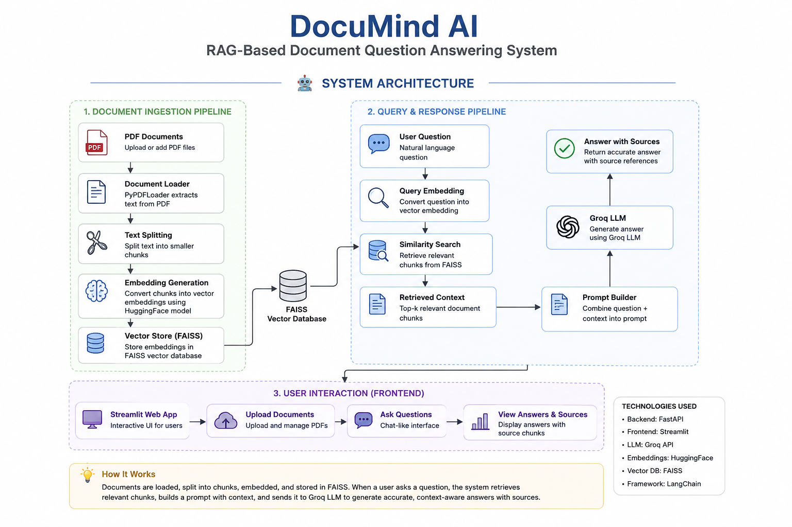
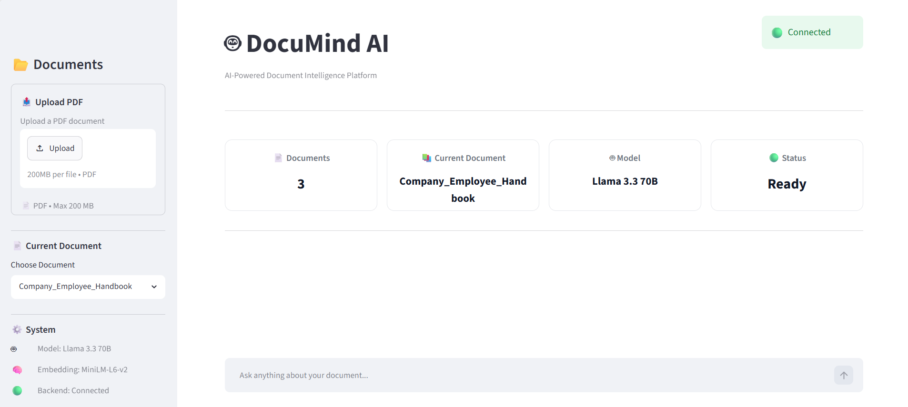
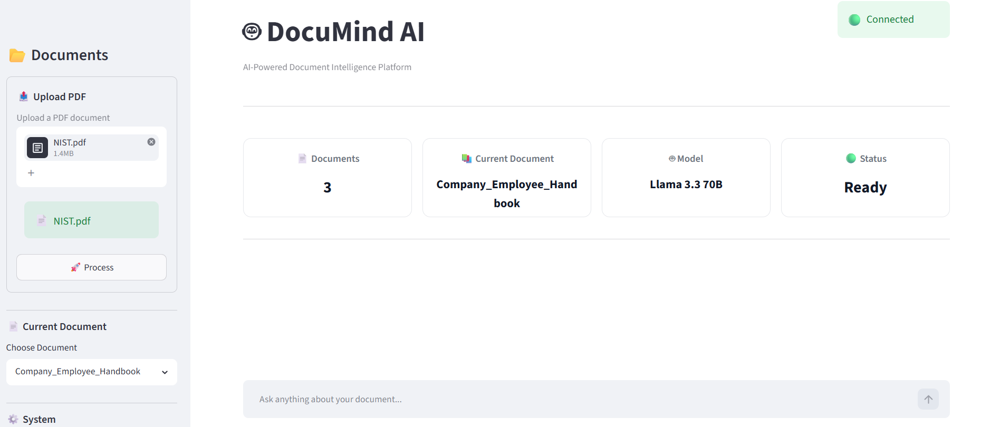
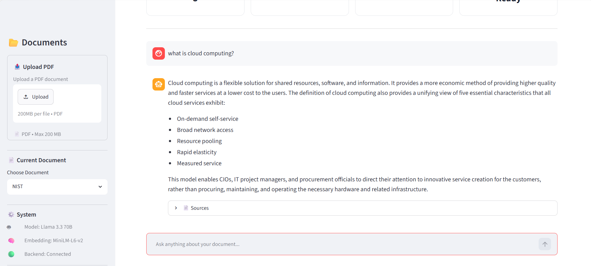
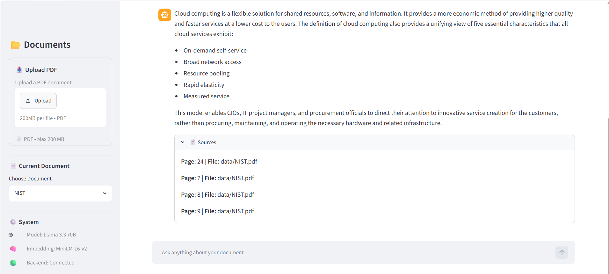

# 📄 DocuMind AI

### Intelligent Document Question Answering using Retrieval-Augmented Generation (RAG)

<p align="center">


</p>

---

## Overview

DocuMind AI is an end-to-end Retrieval-Augmented Generation (RAG) application that enables users to upload PDF documents and interact with them using natural language.

Instead of relying solely on the Large Language Model's knowledge, the system retrieves the most relevant document chunks using semantic search and generates accurate, context-aware responses grounded in the uploaded documents.

---

## 🏗️ System Architecture

<p align="center">
  
</p>

---
## 📸 Application Screenshots

### 🏠 Home Page

<p align="center">

</p>

---

### 📤 Upload Document

<p align="center">

</p>

---

### 💬 Chat Interface

<p align="center">

</p>

---

### 📖 Generated Response

<p align="center">

</p>

---

## Key Features

* PDF document ingestion
* Automatic text chunking
* Semantic vector embeddings
* FAISS vector search
* Retrieval-Augmented Generation (RAG)
* Context-aware question answering
* Source-supported responses
* Interactive Streamlit interface
* FastAPI backend

---

## Technology Stack

| Layer           | Technology  |
| --------------- | ----------- |
| Backend         | FastAPI     |
| Frontend        | Streamlit   |
| RAG Framework   | LangChain   |
| Vector Database | FAISS       |
| Embedding Model | HuggingFace |
| LLM             | Groq        |
| Language        | Python      |

---

## Project Structure

```text
backend/
frontend/
data/
README.md
requirements.txt
```

---

## Getting Started

### Clone Repository

```bash
git clone https://github.com/Sowmiyajanaki/documind-ai.git
```

### Install Dependencies

```bash
pip install -r requirements.txt
```

### Configure Environment

Create a `.env` file.

```text
GROQ_API_KEY=your_api_key
```

### Start Backend

```bash
uvicorn backend.api:app --reload
```

### Launch Frontend

```bash
streamlit run frontend/app.py
```

---

## How It Works

1. Upload one or more PDF documents.
2. Documents are processed and split into semantic chunks.
3. Embeddings are generated using HuggingFace models.
4. Embeddings are indexed in FAISS.
5. User questions are converted into embeddings.
6. Relevant document chunks are retrieved.
7. Context is passed to Groq LLM.
8. The model returns a grounded response with supporting sources.

---

## 🧪 Testing

The `tests/` directory contains development and module-level test scripts used during the implementation of DocuMind AI.

These scripts were used to verify individual components such as:

- Configuration loading
- PDF document processing
- Text chunking
- Embedding generation
- FAISS vector store creation
- Retrieval pipeline
- Groq LLM integration

These tests helped validate each module independently before integrating the complete RAG pipeline.

---

## Future Improvements

* Multi-document collections
* Conversation memory
* OCR for scanned PDFs
* Cloud deployment
* Docker support
* User authentication

---

## Author

**Sowmiya Janaki**

If you found this repository useful, consider giving it a ⭐.
